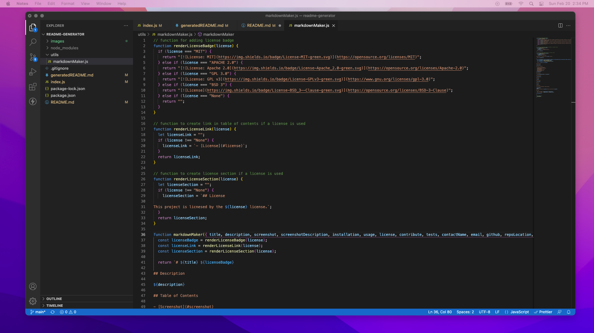

# Good README Generator 

## Description

The application presents the user with a series of questions by utilizing Inquirer. The answers are then used to generator a professional README.md.

## Table of Contents

- [Screenshot](#screenshot)
- [Installation](#installation)
- [Usage](#usage)
- [Contribute](#contribute)
- [Tests](#tests)
- [Questions](#questions)
- [Links](#links)
- [License](#license)

## Screenshot

## Installation

The user must install Inquirer to use this application.

## Usage

Follow the questions and the application will do the rest. This application allows anyone to produce a professional quality README with ease.

## Contribute

Contact the application owner.

## Tests

If Inquirer is not installed, the application will not work.

## Questions

If you have any questions, please contact:

Brett Gould
bgould86@gmail.com
[https://www.github.com/bgould86](https://www.github.com/bgould86)

## Links

- Here is the repo: [https://github.com/bgould86/readme-generator](https://github.com/bgould86/readme-generator)
- Here is the video walk through: [https://www.youtube.com/watch?v=ogYQEJ5lMlo](https://www.youtube.com/watch?v=ogYQEJ5lMlo)

## License

This project is licnesed by the MIT license.
