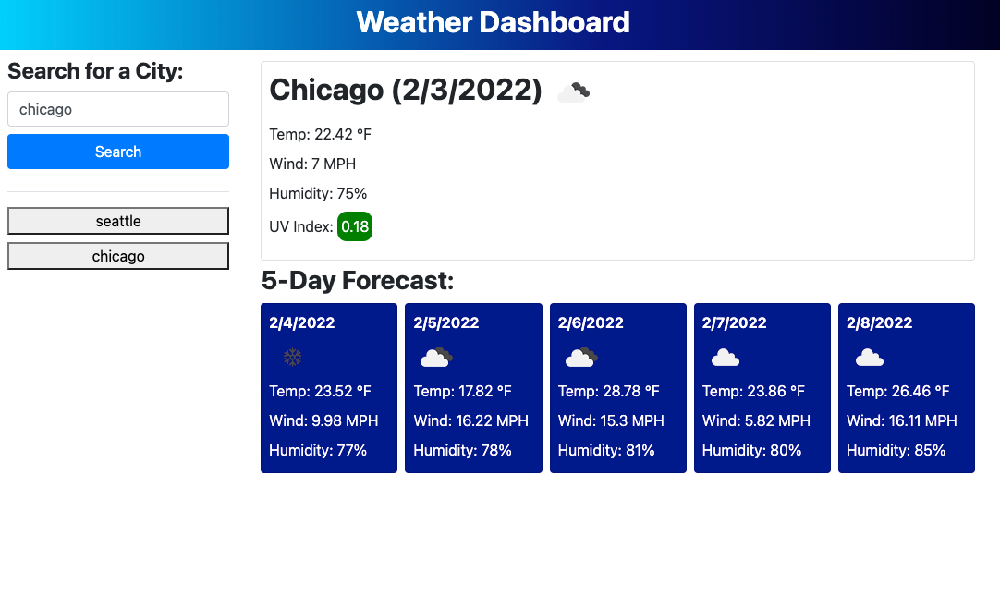

# 06 Server-Side APIs: Weather Dashboard 

## Description

Build a weather dashboard that will run in the browser and feature dynamically updated HTML and CSS.

## Table of Contents

- [Screenshot](#screenshot)
- [Installation](#installation)
- [Usage](#usage)
- [Contribute](#contribute)
- [Tests](#tests)
- [Questions](#questions)
- [Links](#links)
- [License](#license)

## Screenshot

## Installation

This app requires no installations to work properly. 

## Usage

Enter a city name into the input box and it will populate current weather for that city and a five-day forecast. 

## Contribute

Contact the app owner. 

## Tests

Misspell a city name and it will not return a result. 

## Questions

If you have any questions, please contact:

Brett Gould
bgould86@gmail.com
[https://www.github.com/bgould86](https://www.github.com/bgould86)

## Links

- Here is the repo: [https://github.com/bgould86/weather-dashboard](https://github.com/bgould86/weather-dashboard)
- Here is the pages: [https://bgould86.github.io/weather-dashboard/](https://bgould86.github.io/weather-dashboard/)

## License
    
This project is licnesed by the MIT license.
